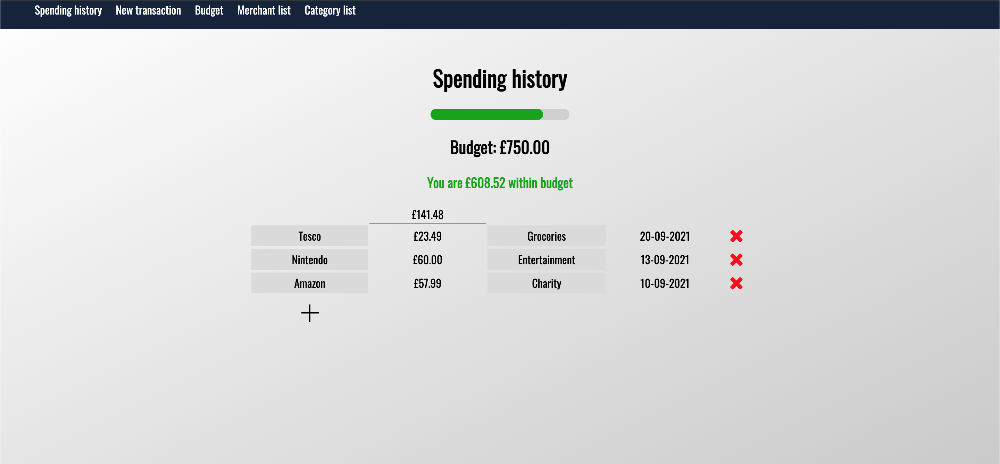

# Spending Tracker 

## Description: 
This spending tracker allows you to add transactions with custom merchants and categories. The amounts are totalled and displayed. 

You can view all spending for particular merchants or spending categories.

You can also set a budget and the spending tracker will display a 'budget bar' giving a visual representation of how much money you have left to spend of your budget. 

The budget bar is programmed to change to orange when you are below 20% of your budget and red when you are below 10%. 

## Technologies used

    python  FLASK   POSTGRESQL  psycopg2    HTML/CSS    jinja

## How to run: 

Install: python, Flask, psycopg2 and jinja
Python
https://www.python.org/downloads/

Enter the following commands into your terminal

    pip install psycopg2
    pip install FLASK
    pip install Jinja2

Clone the repository to your own directory:

    git clone git@github.com:96sii/spending_tracker_project.git

From the cloned repository, run flask by entering the following command in the terminal. (Make sure you are in the project directory): 

    flask run

Open a browser and enter http://localhost:5000/

